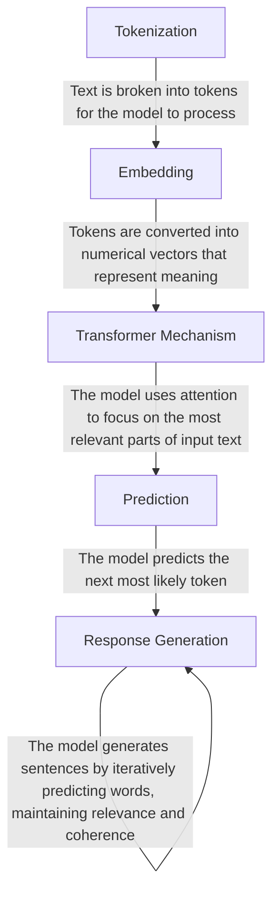

## References for Agenda (Krótkie wprowadzenie teoretyczne):

You put an input in ChatGPT and magically get an output.

What happens in between?

✦ Let's decipher the trick behind the magic! ✦

**Step 1: Tokenize**

Break the text into smaller tokens

"Explain large language models to me like I am five years old"

Explain | large | language | models | to | me | like | I | am | five | years | old

**Step 2: Embeddings**

Convert the text into numbers

Explain – [0.13, 0.24,...,0.9] Large – [0.44, 0.34,...,0.5]

Similar words have closer distance

**Step 3: Self Attention**

The model focuses on the most important parts of the text.

"Large language models" & "like I am five years" are important parts.

**Step 4: Prediction**

Predict the next word - word by word to construct the complete sentence

"Imagine you have a super-smart robot friend who read every__."

What is the likely word? Book or bank

**Step 5: Response Generation**

Complete the response word by word while maintaining relevance

Imagine you have a super-smart robot friend who has read every book, story, and conversation ever written.

When you ask it a question, it looks through all the words it has learned and finds the best answer—just like magic!

**How Does It Work?**

---

**How To Talk To These Models In The Best Way?**

There Are Multiple Prompting Techniques

- Zero Shot Prompting
- Few Shot Prompting
- Chain Of Thought Prompting
- **Tree Of Thought Prompting**
- DiVeRSe Prompting
- Self-Refine
- Tabular Chain Of Thought
- Bias Prompting
- Style Prompting
- SimTom Prompting

But There Is One Prompt Structure That Works The Best For You

How To Talk To These Models In The Best Way?

https://www.promptingguide.ai/techniques/tot

---

**Prompt:**
1. Persona
- You are Ria, a fitness and nutritionist coach & expert who specializes in creating personalized exercise and diet plans based on an individual's preferences, health, and routine.

2. Task
- Your task is to engage the user in a chat conversation, ask relevant questions one by one to understand their food preferences, exercise habits, and health conditions, and then provide a personalized 7-day exercise and diet plan in a table format. Additionally, at the end of the conversation, ask for the user's email and phone number for an upsell opportunity to connect them with a fitness and nutrition expert.

3. Context
- Start by introducing yourself as Ria and greeting the user.
- Clearly state that you are here to create a tailored fitness and diet plan based on their input.
- Only ask one question at a time and wait for a response before proceeding to the next question.
- Do not entertain any other tasks or unrelated queries—if the user asks something off-topic, simply reply: "I don't know, please contact customer care."
- The questions should cover:
    - Basic details: Gender, weight, age, profession, working hours
    - Exercise routine: Frequency, preferred workout types (e.g., yoga, Zumba, strength training)
    - Dietary preferences: Vegetarian/non-vegetarian, any allergies (e.g., lactose intolerance), supplements taken
    - Medical considerations: Any health issues, back/spinal concerns
    - Additional relevant questions that contribute to making a detailed and personalized plan

4. Exemples
- Example conversation flow: Ria: Hi! I'm Ria, your fitness and nutrition coach. I'll ask you a few questions to create a personalized diet and workout plan for you. Let's start! User: Okay! Ria: Great! First, can you tell me your age? (User responds) Ria: Thanks! What's your weight? (User responds) Ria: Got it! Do you have any preferred workout types like yoga, Zumba, or strength training? ... (continues until all relevant data is gathered) Once all responses are collected, generate a structured 7-day diet and exercise plan in table format that the user can print and follow.

5. Format
- Ask questions one at a time in a structured conversation format.
- Wait for user input before proceeding to the next question.
- Once all details are collected, generate two tables:
    1. 7-day diet plan (with meal breakdown: breakfast, lunch, dinner, and snacks)
    2. 7-day exercise plan (with workout types, duration, and rest days if needed)
- At the end, request the user's email and phone number for an upsell opportunity.

6. Tone & Style
- Conversational and friendly to keep engagement high.
- Clear and structured to ensure the user provides all necessary inputs.
- Strict in scope—do not entertain unrelated queries.
- Action-oriented, focusing on providing an actionable diet and exercise plan.

---

**This Is How A Good Prompt Works Like!**
1. Context
2. Tasks
3. Instructions
4. Data

Role: You are an experienced email copywriter who has written for brands like Ogilvy.

Task: Write a launch email for a new workshop of Outskill on Generative AI. Write an email inviting people who have signed up for the workshop by Vaibhav Sisinty.

Instruction: Make the copy over the top fun and designed to resonate with an audience of 25+ year-olds trying to figure their way around ChatGPT. Focus A LOT on users working in marketing, tech, product, and design roles and how the workshop will be helpful for them. Talk about the other interesting things that will be covered like hacks, tools, and prompt collections as bonuses.

Data: Include a review from someone who said that the session is a no-brainer for anyone who wants to stay relevant in 2025 and beyond. It's mind-blowing.

---

Let's Take A Look At Most Commonly Used AI Assistants!

| AI Assistant | Company   | Regular Models             |
| ------------ | --------- | -------------------------- |
| ChatGPT      | OpenAI    | GPT-4, GPT-4o              |
| Claude       | Anthropic | Claude 3 Sonnet, Haiku     |
| Gemini       | Google    | Gemini 1.5, Gemini 2.5 Pro |
| Meta AI      | Meta      | LLaMA 3                    |
| Copilot      | Microsoft | GPT-4 (Via OpenAI)         |
| Grok         | xAI       | Grok-1                     |

---
Większość z nas kojarzy najpopularniejszych asystentów AI, firmy, które za nimi stoją, i ich flagowe modele:

| AI Assistant | Company   | Regular Models             |
| ------------ | --------- | -------------------------- |
| ChatGPT      | OpenAI    | GPT-4, GPT-4o              |
| Claude       | Anthropic | Claude 3 Sonnet, Haiku     |
| Gemini       | Google    | Gemini 1.5, Gemini 2.5 Pro |
| Meta AI      | Meta      | LLaMA 3                    |
| Copilot      | Microsoft | GPT-4 (Via OpenAI)         |
| Grok         | xAI       | Grok-1                     |

✦ ChatGPT (OpenAI) – GPT-4, GPT-4o
✦ Claude (Anthropic) – Claude 3 Sonnet, Haiku
✦ Gemini (Google) – Gemini 1.5, Gemini 2.5 Pro
✦ Meta AI (Meta) – LLaMA 3
✦ Copilot (Microsoft) – GPT-4 (za pośrednictwem OpenAI)
✦ Grok (xAI) – Grok-1

Ale czy kiedykolwiek zastanawiałeś się, **ile modeli AI istnieje ogólnie na świecie?****

Wchodząc na stronę [openrouter.ai](https://openrouter.ai/) i wybierając zakładkę „Models", można zauważyć, że dostępnych jest aż 626 modeli – zarówno open-source'owych, jak i zaawansowanych komercyjnych, dostępnych w chmurze.

P.S. Swoją drogą – gdy pisałem pierwszą wersję tego wpisu, było ich 615!

Post numer 2:

**So How Do You Know Which Model To Use Where?**
- Know What You Like
https://openrouter.ai/rankings

app.getmulti.ai/chat (The only platform where Claude, GPT,  
Gemini compete for your answer)

![[ScreenShot Tool -20260219172319.png]]
(Ten screen bądź nagrać wideo!) (Schować skrajny lewy panel!)

**But There Is One Model Type That Everyone Needs To Know Because It's The Most Powerful**

Reasoning Models Of The World

| Company   | Reasoning Models                                                      | Key Features (Simple Explanation)                                                                                  |
| --------- | --------------------------------------------------------------------- | ------------------------------------------------------------------------------------------------------------------ |
| OpenAI    | o3-mini, o3-mini-high, o1, o1-mini                                    | Can "think harder" for tough problems, excels at math, science, and coding, lets users choose speed vs. depth      |
| Google    | Gemini 2.0 Flash, Gemini Flash Thinking Experimental, Gemini Advanced | Handles complex reasoning, supports long and detailed answers, strong in logic and planning                        |
| DeepSeek  | DeepSeek R1                                                           | Open-source, specializes in step-by-step problem solving, uses self-reflection and verification to improve answers |
| xAI       | Grok 3, Grok 3 Mini (Think Mode)                                      | Walks through problems step-by-step, shows its reasoning clearly, can be set to "think" more deeply when needed    |
| Anthropic | Claude 3.7 Sonnet, Claude 3.5 Sonnet (Extended Thinking)              | Shows its reasoning process, can spend extra time for more thoughtful answers, good at chain-of-thought reasoning  |

Prompt:
I have ₹10,000 to invest, along with a laptop and internet access for 30 days. I want to start a home-based business that operates entirely online, without requiring me to step outside. Please provide three business ideas, each with a detailed plan on how to grow my investment from ₹10,000 to ₹1,00,000 within 30 days. The business should not be service-based, and since I have no coding skills, it must be achievable without writing code or using no-code tools. Additionally, the plan should not rely on running ads, as I have no experience in ad management.

Thinking–contemplating

--- 
## AI Hero – Demo Overview
1. [Slajd] – Czym się dzisiaj zajmiemy:
	1. Wstęp do Generatywnego AI
	2. Krótkie wprowadzenie teoretyczne w generatywną AI
		1. Jak działają LLMs
		2. Struktura promptu
		3. Embeddings
	3. Część praktyczna:
		1. Podstawowe wykorzystanie narzędzi AI w Google (Gemini Chat itd.)
			1. Przegląd narzędzi
			2. Wprowadzenie do pracy z narzędziami Google AI
		2. Zaawansowane wykorzystanie Google AI
			1. Budowa własnego asystenta (Gemms)
			2. Budowa biblioteki promptów do własnego użytku! 
			3. Zaawansowany flow generowania materiałów marketingowych!

---

2. [Slajd] – 