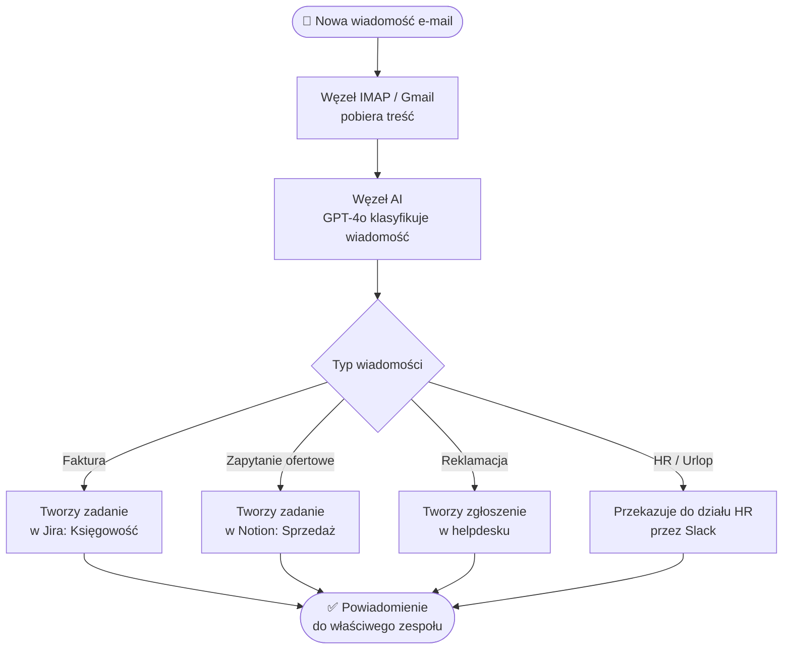
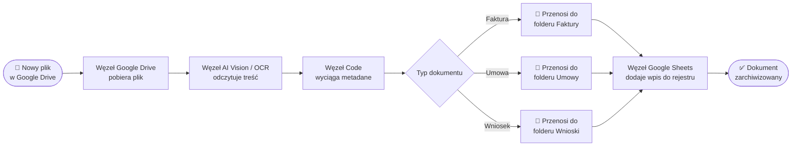
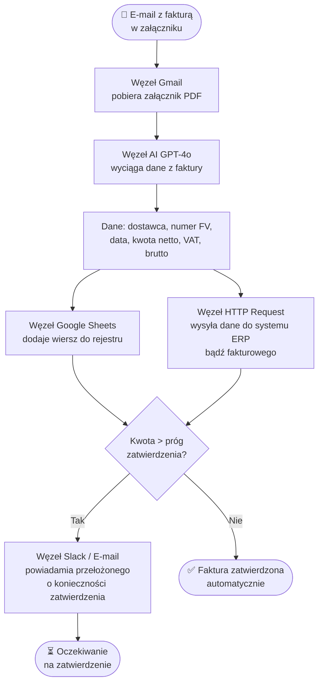
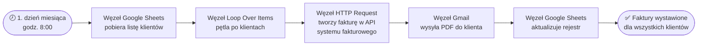
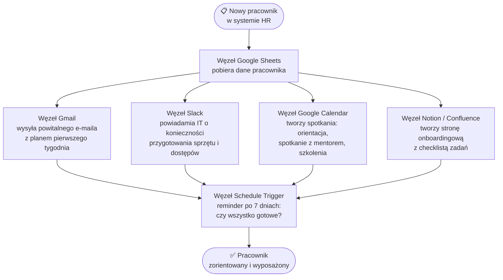
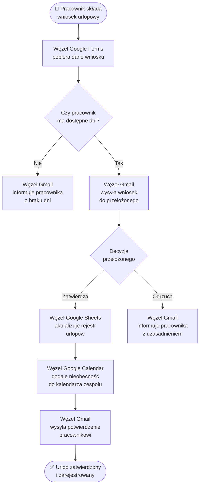

## n8n w automatyzacji biura, księgowości i administracji

Codzienna praca biurowa składa się w znacznej mierze z zadań powtarzalnych: przeklejania danych między arkuszami, ręcznego opisywania faktur, wysyłania cyklicznych przypomnień, tworzenia raportów ze zgromadzonych wcześniej informacji bądź powiadamiania właściwych osób o zmianie statusu dokumentu. Każde z tych zadań z osobna zajmuje niewiele czasu, ale łącznie pochłaniają godziny tygodniowo i generują błędy tam, gdzie człowiek jest słabym ogniwem: w żmudnych, mechanicznych operacjach.

n8n jest platformą, która eliminuje tę kategorię pracy. Nie przez "magię jednego kliknięcia" w stylu gotowych konektorów, lecz przez pełnoprawne środowisko do projektowania przepływów danych z logiką warunkową, kodem i AI. Dla biur, działów finansowych i administracji oznacza to jedno: możesz zautomatyzować niemal każdy powtarzalny proces, który da się opisać słowami "jeśli dzieje się X, zrób Y, a potem powiadom Z".

---

## Biuro: automatyzacja codziennej pracy

### Klasyfikacja i routing wiadomości e-mail

Skrzynka odbiorcza jest jednym z największych "wąskich gardeł" w biurze. Typowy pracownik spędza od 1 do 2 godzin dziennie na sortowaniu poczty, przekierowywaniu wiadomości do właściwych osób bądź tworzeniu zadań na podstawie treści e-maili.

n8n, z pomocą węzła **IMAP Email** (bądź dedykowanego węzła **Gmail**) i modelu językowego, potrafi:
- pobrać nową wiadomość ze skrzynki,
- przeanalizować jej treść za pomocą AI (np. GPT-4o),
- sklasyfikować ją (np. faktura, zapytanie ofertowe, reklamacja, HR),
- dodać odpowiedni tag bądź etykietę,
- utworzyć zadanie w systemie zarządzania projektami (Jira, Asana, Notion),
- wysłać powiadomienie do właściwego działu na Slacku bądź przez e-mail.

![[screenshots-n8n-office/email-classification-workflow-placeholder.png]]

---

### Automatyczne zarządzanie dokumentami

Dokumenty trafiają do firm różnymi kanałami: jako załączniki do e-maili, pliki przesyłane przez formularze bądź skany wgrywane do współdzielonych dysków. Ich ręczne porządkowanie, opisywanie i archiwizowanie to żmudne zajęcie.

Przykładowy przepływ z n8n:
1. **Wyzwalacz**: nowy plik pojawia się w wyznaczonym folderze Google Drive bądź jako załącznik e-mail.
2. **AI OCR**: węzeł AI odczytuje zawartość dokumentu (PDF, JPG, PNG) i wyciąga kluczowe metadane, np. datę, typ dokumentu, nadawcę.
3. **Klasyfikacja**: na podstawie metadanych przepływ decyduje, do którego folderu przenieść plik (umowy, faktury, wnioski, korespondencja).
4. **Archiwizacja**: plik trafia do właściwego folderu z automatycznie nadaną nazwą (np. `2025-02-18_FV_Kowalski_sp._z_o.o.`).
5. **Rejestr**: wpis z metadanymi trafia do arkusza Google Sheets bądź bazy danych.

![[screenshots-n8n-office/document-management-workflow-placeholder.png]]

---

### Cykliczne raporty i podsumowania

Menedżerowie potrzebują regularnych podsumowań: tygodniowych raportów sprzedaży, dziennych statusów zadań bądź miesięcznych zestawień aktywności. Ich ręczne przygotowywanie to praca, którą niemal w całości można oddać platformie automatyzacji.

n8n pozwala zaplanować przepływ (węzeł **Schedule Trigger**), który o określonej godzinie:
- pobiera dane z CRM, arkusza kalkulacyjnego bądź bazy danych,
- agreguje i przetwarza je w węźle **Code**,
- generuje raport w formie HTML bądź PDF,
- wysyła go e-mailem bądź wkleja jako wiadomość na kanał Slacka.

> **Przykład z praktyki:** Firma korzystająca z HubSpot jako CRM i Google Sheets jako rejestru zadań może skonfigurować przepływ, który każdy poniedziałek o 7:45 wysyła kierownikowi sprzedaży podsumowanie: ile leadów wpłynęło w poprzednim tygodniu, ile przeszło do kolejnego etapu, ile umów zostało podpisanych. Bez angażowania kogokolwiek.

---

## Księgowość: automatyzacja procesów finansowych

### Przetwarzanie faktur kosztowych

Obsługa faktur kosztowych to klasyczny przykład pracy, w której człowiek wykonuje serię identycznych kroków dla każdego dokumentu: pobiera załącznik, odczytuje dane, wpisuje je do systemu, weryfikuje i przekazuje do zatwierdzenia. n8n z modelem AI radykalnie skraca ten łańcuch.

Typowy przepływ przetwarzania faktur kosztowych:

![[screenshots-n8n-office/invoice-processing-workflow-placeholder.png]]

Przepływ wyciąga z faktury: nazwę dostawcy, numer faktury, datę wystawienia i termin płatności, kwotę netto, VAT i brutto, a nawet numer rachunku bankowego. Dane trafiają bezpośrednio do rejestru faktur w Google Sheets oraz (przez API) do systemu księgowego.

> **Warto wiedzieć:** Polskie systemy fakturowe takie jak iFirma, inFakt bądź Fakturownia udostępniają API, przez co n8n może integrować się z nimi bezpośrednio za pomocą węzła **HTTP Request**. Węzeł ten pozwala wywołać dowolne API REST, co oznacza, że brak natywnego węzła dla danego systemu nie stanowi bariery.

---

### Cykliczne wystawianie faktur sprzedażowych

Firmy świadczące usługi w modelu abonamentowym (subskrypcje, retainery, wynajem) wystawiają co miesiąc powtarzalne faktury dla tych samych klientów z tymi samymi pozycjami. To idealne zadanie dla automatyzacji.

Przepływ:
1. **Wyzwalacz czasowy** (np. 1. dzień miesiąca, godz. 8:00).
2. **Google Sheets / baza danych**: pobiera listę aktywnych klientów z kwotami i danymi fakturowymi.
3. **Pętla**: dla każdego klienta wywołuje API systemu fakturowego i tworzy fakturę.
4. **E-mail**: wysyła gotową fakturę w PDF bezpośrednio do klienta.
5. **Rejestr**: aktualizuje arkusz z datą wystawienia i numerem faktury.

![[screenshots-n8n-office/recurring-invoices-workflow-placeholder.png]]

---

### Monitorowanie płatności i przypomnienia

Zalegające należności to problem każdej firmy. Ręczne przeglądanie rejestru faktur i wysyłanie przypomnień jest pracochłonne i często odkładane "na później". n8n może zastąpić ten proces w całości.

Przepływ sprawdza codziennie rejestr faktur w arkuszu Google Sheets bądź systemie fakturowym, identyfikuje faktury, których termin płatności minął, i:
- wysyła uprzejme przypomnienie e-mailowe (treść generowana przez AI, spersonalizowana dla klienta),
- po kolejnych 7 dniach bez odpowiedzi: wysyła drugie, bardziej stanowcze przypomnienie,
- po 14 dniach: generuje raport i powiadamia właściwą osobę w firmie o konieczności kontaktu telefonicznego.

---

## Administracja i HR: automatyzacja procesów kadrowo-organizacyjnych

### Onboarding nowego pracownika

Onboarding to proces składający się z kilkunastu zadań rozłożonych w czasie: przygotowania sprzętu, nadania dostępów, zapisania na szkolenia, przypisania mentora, wysłania dokumentów do podpisania. Ich koordynacja przez dział HR pochłania wiele godzin i łatwo o pominięcie któregoś kroku.

n8n może skoordynować cały onboarding na podstawie jednego zdarzenia: dodania nowego pracownika do systemu HR bądź wypełnienia formularza przez rekrutację.

![[screenshots-n8n-office/employee-onboarding-workflow-placeholder.png]]

> **Przykład z praktyki:** Firma zatrudniająca kilkanaście osób rocznie wdrożyła w n8n przepływ onboardingowy, który redukuje czas poświęcany przez HR na koordynację z ~4 godzin na pracownika do ~15 minut (weryfikacja, czy wszystkie kroki zostały wykonane automatycznie).

---

### Obsługa wniosków urlopowych

Wniosek urlopowy to klasyczny przykład procesu wymagającego przepływu informacji między kilkoma osobami: pracownikiem, przełożonym i działem HR. Ręczna koordynacja przez e-mail generuje chaos — szczególnie przy większym zespole.

Przepływ:
1. Pracownik wypełnia formularz (Google Forms, Typeform bądź formularz w intranecie).
2. n8n pobiera dane i sprawdza w Google Sheets (bądź systemie HR), czy pracownik ma dostępne dni urlopowe.
3. Wysyła wniosek do przełożonego z linkiem do zatwierdzenia bądź odrzucenia (używając **Webhook** z tokenem).
4. Po zatwierdzeniu: aktualizuje rejestr urlopów, dodaje nieobecność do kalendarza zespołu, wysyła potwierdzenie pracownikowi.
5. Po odrzuceniu: wysyła do pracownika informację z uzasadnieniem.

![[screenshots-n8n-office/vacation-request-workflow-placeholder.png]]

---

### Cykliczne przypomnienia administracyjne

Każda firma ma powtarzające się obowiązki administracyjne z terminami: badania lekarskie pracowników, przeglądy sprzętu, odnowienie licencji oprogramowania, terminowe składanie deklaracji podatkowych, ubezpieczenia. Ich pilnowanie "z głowy" bądź w Excelu jest zawodne.

n8n może pełnić rolę inteligentnego systemu przypomnień:
- Arkusz Google Sheets bądź baza danych przechowuje rejestr terminów z datami ważności.
- Przepływ sprawdza codziennie, które terminy zbliżają się (np. 30, 14 i 7 dni przed datą).
- Wysyła spersonalizowane przypomnienie do właściwej osoby: "Badanie lekarskie Anny Kowalskiej wygasa 15.03.2025 — zaplanuj wizytę."
- Po wykonaniu zadania: pracownik aktualizuje rejestr, przepływ potwierdzenia zamknięcia jest opcjonalny.

---

## Rola AI w automatyzacji biurowej

Tradycyjna automatyzacja działała na danych ustrukturyzowanych: liczbach, datach, wybranych opcjach z list. Dokumenty tekstowe, e-maile bądź treść faktur w formacie PDF były poza zasięgiem prostych przepływów.

Integracja n8n z modelami językowymi (GPT-4o, Claude, Gemini) zmienia tę równanie. AI pełni rolę warstwy rozumienia: przekształca nieustrukturyzowany tekst w dane, które reszta przepływu może przetwarzać. Konkretnie:

| Zadanie | Bez AI | Z AI w n8n |
|---|---|---|
| Odczyt faktury PDF | Wymaga stałego formatu bądź ręcznego przepisywania | Wyciąga dane z dowolnie sformatowanej faktury |
| Klasyfikacja e-maili | Tylko na podstawie reguł (temat, nadawca) | Na podstawie treści, kontekstu i intencji nadawcy |
| Generowanie raportów | Statyczne szablony z podstawionymi liczbami | Narracyjne podsumowania z interpretacją trendów |
| Obsługa wniosków | Wymaga formularza z polami | Rozumie wniosek napisany naturalnym językiem |
| Przypomnienia i komunikacja | Statyczne szablony wiadomości | Spersonalizowane, kontekstowe komunikaty |

---

## Jak zacząć: od której automatyzacji?

Wybór pierwszego przepływu do wdrożenia powinien wynikać z analizy, gdzie tracisz najwięcej czasu na powtarzalne zadania. Kilka pytań, które pomogą to zidentyfikować:

1. **Co robisz co tydzień dokładnie tak samo?** Cykliczne raporty, przypomnienia, faktury cykliczne — to pierwsi kandydaci.
2. **Gdzie przepisujesz dane z jednego miejsca do drugiego?** Każde ręczne kopiowanie między systemami to przypadek dla automatyzacji.
3. **Gdzie czekasz na odpowiedź innej osoby, żeby móc kontynuować?** Procesy zatwierdzania (faktury, urlopy, oferty) doskonale nadają się na przepływy z węzłami oczekiwania i powiadomieniami.
4. **Gdzie popełniacie błędy?** Tam, gdzie człowiek się myli, automatyzacja jest najbardziej wartościowa.

Dobrą strategią na start jest wdrożenie jednego, prostego przepływu (np. powiadomienie na Slacku przy nowym e-mailu z fakturą) i stopniowe rozbudowywanie go o kolejne kroki. n8n pozwala zacząć małymi krokami i iteracyjnie dodawać złożoność.

---

## Podsumowanie

n8n wpisuje się w realia pracy biurowej, księgowej i administracyjnej, ponieważ adresuje dokładnie te obszary, w których powtarzalność i przepływ danych między wieloma systemami generują największe straty czasu:

- **Biuro**: routing e-maili, archiwizacja dokumentów, cykliczne raporty, synchronizacja kalendarzy.
- **Księgowość**: przetwarzanie faktur kosztowych, cykliczne wystawianie faktur, monitoring płatności i przypomnień.
- **HR i administracja**: onboarding pracowników, obsługa wniosków urlopowych, pilnowanie terminów administracyjnych.

Kluczową przewagą n8n nad prostszymi narzędziami w tych zastosowaniach jest możliwość łączenia logiki warunkowej, kodu i modeli AI w obrębie jednego przepływu. Faktura z niestandardowym formatem? AI sobie poradzi. Wniosek urlopowy wymagający zatwierdzenia przez kilka poziomów hierarchii? Gałęzie przepływu to obsłużą. Raport wymagający danych z czterech różnych systemów? Węzeł **Merge** połączy je w jeden wynik.

Automatyzacja biurowa z n8n to nie kwestia "czy warto" — to kwestia "od której powtarzalnej czynności zacząć".

---

*Źródła i dalsze lektury:*
- *[n8n: Accounting Automation Use Cases – Satva Solutions](https://satvasolutions.com/use-cases/n8n-accounting-automation-use-cases)*
- *[10 procesów biznesowych do automatyzacji w n8n – Cognity](https://www.cognity.pl/10-procesow-biznesowych-do-automatyzacji-w-n8n)*
- *[n8n Workflow Examples – Hostinger](https://www.hostinger.com/tutorials/n8n-workflow-examples)*
- *[n8n Use Cases 2025 – Groove Technology](https://groovetechnology.com/blog/n8n/exploring-n8n-use-cases-your-ultimate-guide-to-smarter-automation-in-2025/)*
- *[Automatyzacja faktur w firmie – Half Bit Studio](https://halfbitstudio.com/automatyzacja-faktur-w-firmie/)*
- *[Szablony n8n: Document Ops (912 przepływów)](https://n8n.io/workflows/categories/document-ops/)*
